# Breast Cancer Ultrasound Image based Prediction

**Note: This project is under-development and currently the model is seen to be overfitted. Some predictions of model is wrong.**

This is a learning based project which is trained on benign, malignant, & normal breasts ultrasound to make predictions about the disease. Breast cancer is a common disease among women and rare among mens. Making such project can be a helpful tool for doctors to find type on ease. It is note-worthy that this model gives good results even after being overfitted. 
This project is leveraged using a simple CNN architecture for predictions.

## Table of contents
* [Project Overview](#project-overview)
* [Project Structure](#project-structure)
* [Data](#data)
* [Model Architecture](#model-architecture)
* [Training & Evaluation](#training-&-evaluation)
* [StreamLit App](#streamlit-app)
* [Libraries Used](#libraries-used)
* [Cloning and using the repository](#cloning-and-using-the-repository)

## Project Overview 
Breast cancer is a complex disease characterized by the uncontrolled growth of cells in the breast tissue.  It's the most common cancer diagnosed in women worldwide, though men can also be affected.  Early detection through mammograms and self-exams is crucial for improving treatment outcomes.  While the exact causes are not fully understood, risk factors include age, family history, and certain lifestyle choices.  Research continues to advance our understanding of breast cancer, leading to more effective therapies and improved survival rates.

This project aims to provide a support to medical professionals & non-medical folks to get to know about themselves at ease.

## Project Structure 
```
Breast Cancer detection - NeuralNets
|-- imgs # Contains output images or other history 
    |-- confusion_matrix_simple_cnn.png
    |-- results_simple_cnn.png
    |-- sample_images_and_masks_09_images.png
    |-- sample_images_and_masks.png
    |-- streamlit_app_home.png
    |-- streamlit_app_malignant_pred.png
    |-- streamlit_app_malignant_uploaded_img.png
    |-- streamlit_app_normal_pred.png
    |-- streamlit_app_pred.png
    |-- streamlit_app_uploaded_img.png
    |-- training_history_simple_cnn.png
|-- app.py # Contains StreamLit code
|-- evaluate.py # Contains testing code 
|-- main.py # The main file to call 
|-- models.py # Contain models architechture
|-- requirements.txt # Contains dependencies used during projects
|-- train.py # Contains code for training the model 
|-- utils.py # Contains code for data preprocessing & loading 
|-- viz.py # Contains visualization code -- History, Metrics, Samples, ...
```

## Data 
> Dataset Link: https://www.kaggle.com/datasets/subhajournal/busi-breast-ultrasound-images-dataset

The data collected at baseline include breast ultrasound images among women in ages between 25 and 75 years old. This data was collected in 2018. The number of patients is 600 female patients. The dataset consists of 780 images with an average image size of 500*500 pixels. The images are in PNG format. The ground truth images are presented with original images. The images are categorized into three classes, which are normal, benign, and malignant.

Research Curtesy: Al-Dhabyani W, Gomaa M, Khaled H, Fahmy A. Dataset of breast ultrasound images. Data in Brief. 2020 Feb;28:104863. DOI: 10.1016/j.dib.2019.104863.

Cred: Descriptions is taken from the provided link. 

### Sample images of data 

#### Random 9 images with it's mask
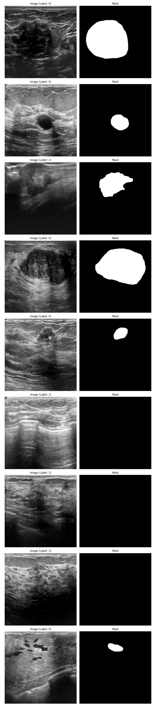

#### Random 3 images with it's mask 
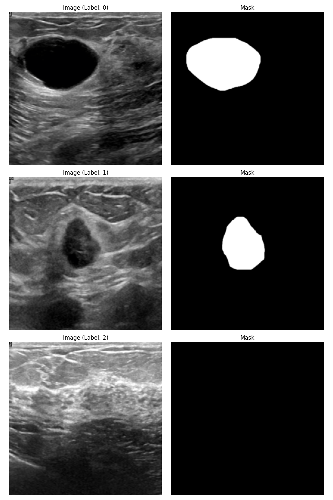

## Model Architecture 
**A simple Convolutional Neural Network with two Convolution layer with max pooling and two fully connected layer with output layer for 3 classes.**


## Training & Evaluation 
### Training history - showing model being overfitted
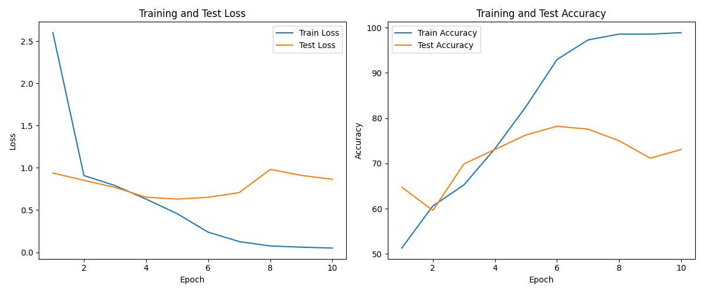

### Confusion matrix 
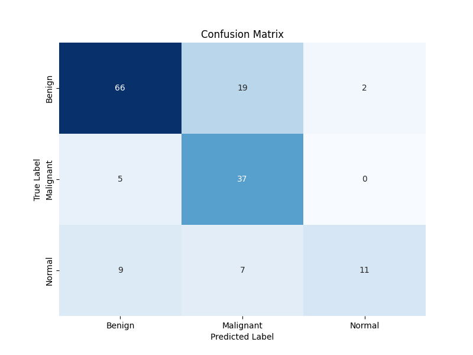

### Complete result of model evaluation -- Overfitted
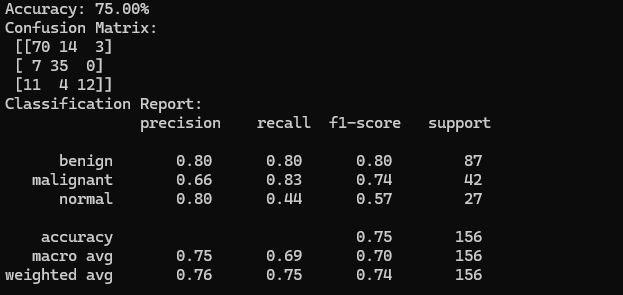

_Model needs some improvement to mitigate overfitting. This can be achieved using Regularization, Dropout, etc. Or some other models such as UNet can be used which is a ResNet34 architechture better for image segmentation._

## StreamLit App
Use following command on terminal to run the app:
```bash
streamlit run app.py
```
### Home page 
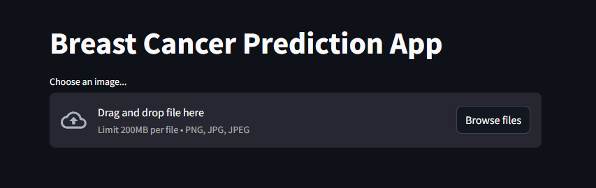

### Uploading a malignant ultrasound
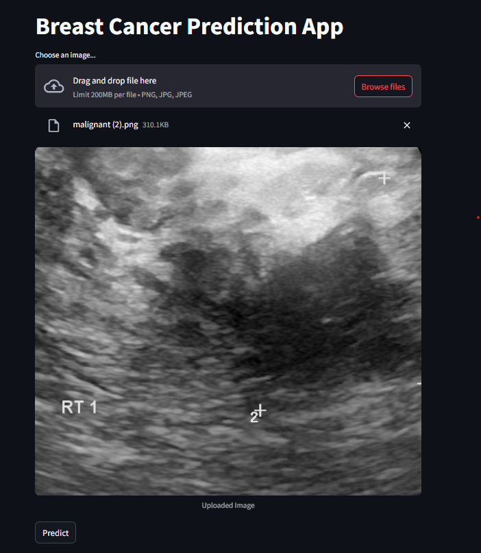

### Predicting as Malignant
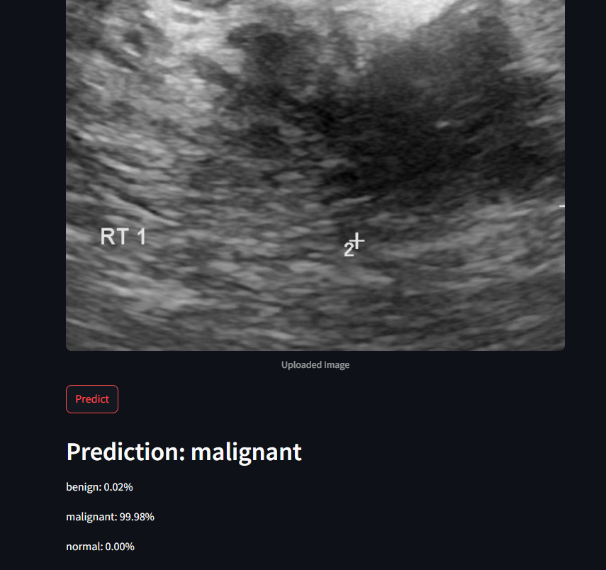

### Uploading a benign ultrasound
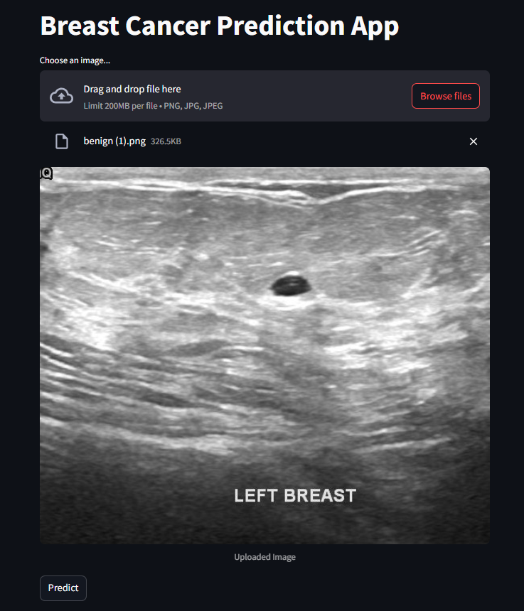

### Predicting as Benign
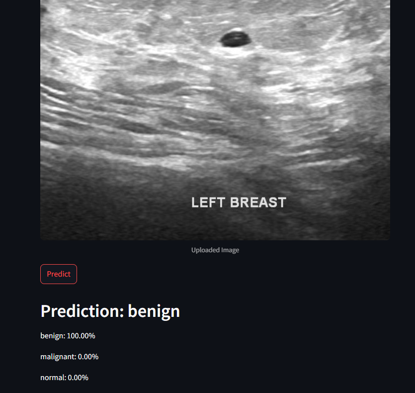

### Normal breast ultrasound & prediction
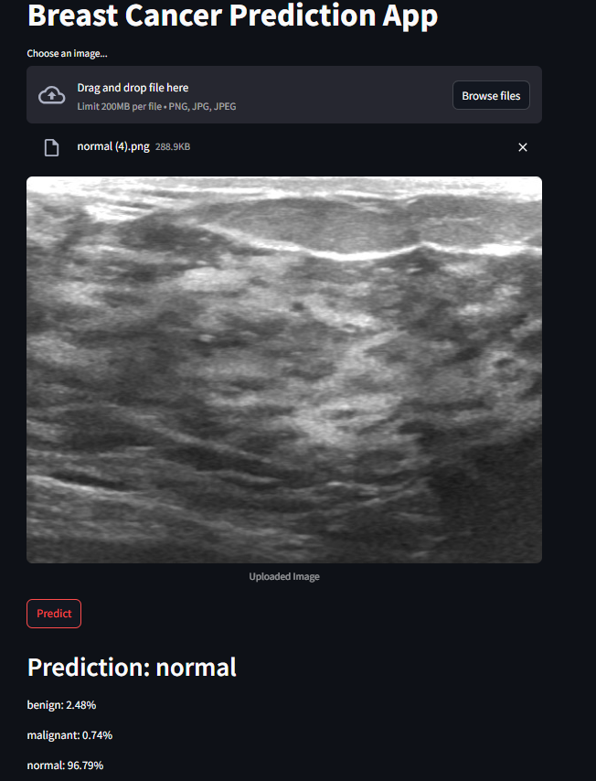

## Libraries Used 
Many Python libraries is being used such as NumPy, Matplotlib, Seaborn, PyTorch etc.
To download the dependencies used in this project, use following command on terminal
```bash
pip install -r requirements.txt
```

## Cloning and using the repository 
To clone this project on your system, use the following command on terminal:
```bash
git clone https://github.com/UmerSalimKhan/Breast-Cancer-Ultrasound-Prediction.git
```

Once, this project repository is cloned, moved to the project root folder and execute the above command. Once, all this is set, use the StreamLit command provided in StreamLit App section.
