# Breast Cancer Ultrasound Image based Prediction

**Note: This project is under-development and currently the model is seen to be overfitted. However, significant steps were taken sucessfully to reduce overfitting and imporve model test accuracy. Some predictions of model is still wrong. Especially for _normal_ class.**

This is a learning based project which is trained on benign, malignant, & normal breasts ultrasound to make predictions about the disease. Breast cancer is a common disease among women and rare among mens. Making such project can be a helpful tool for doctors to find type on ease. It is note-worthy that this model gives good results even after being overfitted. 
This project is leveraged using a quad CNN weighted class architecture for predictions currently _(as of 13 Feb, 2025)_.

## Table of contents
* [Project Overview](#project-overview)
* [Project Structure](#project-structure)
* [Data](#data)
* [Model Architecture](#model-architecture)
* [Training & Evaluation](#training-&-evaluation)
* [StreamLit App](#streamlit-app)
* [Libraries Used](#libraries-used)
* [Cloning and using the repository](#cloning-and-using-the-repository)

## Project Overview 
Breast cancer is a complex disease characterized by the uncontrolled growth of cells in the breast tissue.  It's the most common cancer diagnosed in women worldwide, though men can also be affected.  Early detection through mammograms and self-exams is crucial for improving treatment outcomes.  While the exact causes are not fully understood, risk factors include age, family history, and certain lifestyle choices.  Research continues to advance our understanding of breast cancer, leading to more effective therapies and improved survival rates.

This project aims to provide a support to medical professionals & non-medical folks to get to know about themselves at ease.

## Project Structure 
```
Breast Cancer detection - NeuralNets
|-- imgs # Contains output images or other history 
    |-- cnn
        |-- confusion_matrix_simple_cnn.png
        |-- results_simple_cnn.png
        |-- sample_images_and_masks_09_images.png
        |-- sample_images_and_masks.png
        |-- streamlit_app_home.png
        |-- streamlit_app_malignant_pred.png
        |-- streamlit_app_malignant_uploaded_img.png
        |-- streamlit_app_normal_pred.png
        |-- streamlit_app_pred.png
        |-- streamlit_app_uploaded_img.png
        |-- training_history_simple_cnn.png
        |-- ...
    |-- unet
        |-- ...
|-- models # Various models saved in this folder
    |-- ...
|-- app.py # Contains StreamLit code
|-- evaluate.py # Contains testing code 
|-- main.py # The main file to call 
|-- models.py # Contain models architechture
|-- requirements.txt # Contains dependencies used during projects
|-- train.py # Contains code for training the model 
|-- utils.py # Contains code for data preprocessing & loading 
|-- viz.py # Contains visualization code -- History, Metrics, Samples, ...
```

## Data 
> Dataset Link: https://www.kaggle.com/datasets/subhajournal/busi-breast-ultrasound-images-dataset

The data collected at baseline include breast ultrasound images among women in ages between 25 and 75 years old. This data was collected in 2018. The number of patients is 600 female patients. The dataset consists of 780 images with an average image size of 500*500 pixels. The images are in PNG format. The ground truth images are presented with original images. The images are categorized into three classes, which are normal, benign, and malignant.

Research Curtesy: Al-Dhabyani W, Gomaa M, Khaled H, Fahmy A. Dataset of breast ultrasound images. Data in Brief. 2020 Feb;28:104863. DOI: 10.1016/j.dib.2019.104863.

Cred: Descriptions is taken from the provided link. 

### Sample images of data 

#### Random 9 images with it's mask
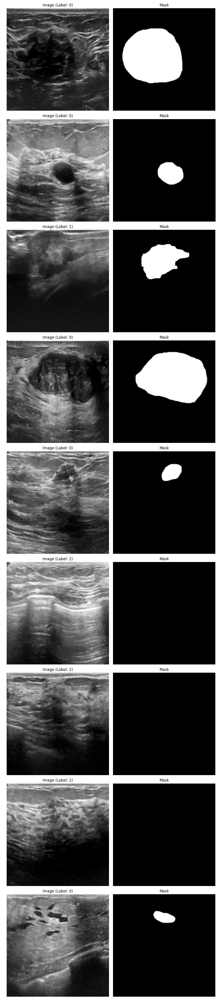

#### Random 3 images with it's mask 
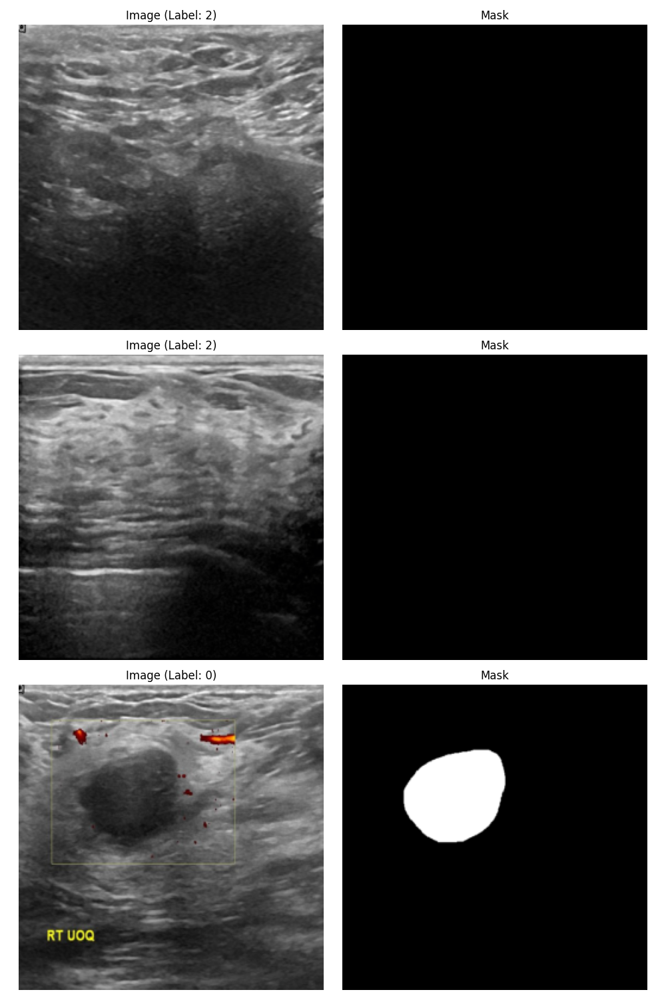

## Model Architecture 
### Convolutional Neural Network 
**A Quad Convolutional Neural Network with 4 Convolution layer with Batch Normalization, max pooling and Four fully connected layer with output layer for 3 classes.**

### UNet 
**The UNet-based model utilizes a pre-trained ResNet34 encoder, initialized with weights from ImageNet. The decoder portion of the standard UNet architecture has been removed, leaving only the encoder for feature extraction. The output of the encoder, which may be a list of feature maps, is processed by selecting the last feature map. This selection is based on the understanding that later feature maps capture higher-level semantic information. Global average pooling is then applied to reduce the spatial dimensions of the selected feature map to a single point, creating a feature vector. This vector is passed through a classification head consisting of two fully connected layers with a ReLU activation and dropout (0.65) in between, followed by a final linear layer to produce logits for each class.  A softmax function then converts these logits into class probabilities.**

#### UNet with variations & there results:
*We have four scenarious below. Each were recorded during the improvement experiment.*

1. Scenario 1 (0.65 Dropout, Weight Decay, Scheduler, No Class Weight):  75% Train, 73% Test.  This shows significant underfitting. The model isn't learning well, even on the training data.

2. Scenario 2 (0.6 Dropout, Weight Decay, Scheduler, Class Weight): 72% Train, 72% Test.  Similar to the first scenario, this indicates underfitting, even though class weights are included.  The model is too regularized or not complex enough.

3. Scenario 3 (0.6 Dropout, No Weight Decay, Scheduler, Class Weight): 98% Train, 92% Test.  This is the most promising result so far.  High training accuracy and good test accuracy suggest that the model is learning well.  The gap (6%) is reasonable. Currently, reason for gap is not known but is likely due to the inherent difficulty of the data.  The absence of weight decay is likely allowing the model to learn more complex patterns.

4. Scenario 4 (0.5 Dropout, No Weight Decay, No Scheduler, No Class Weight): 99% Train, 89% Test.  This shows overfitting.  The model is memorizing the training data (very high training accuracy) but not generalizing as well to the test data (lower test accuracy).

##### Table 
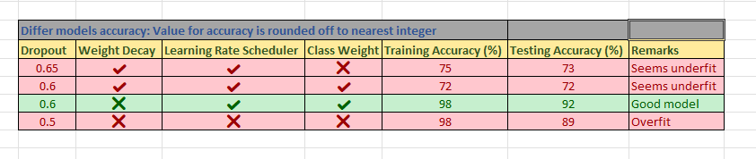

##### Visuals
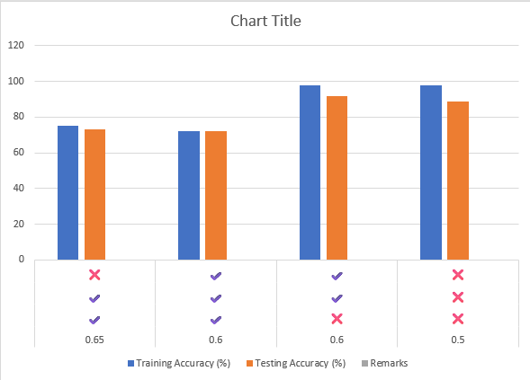

## Training & Evaluation 
### CNN 
#### Training history - showing model being overfitted
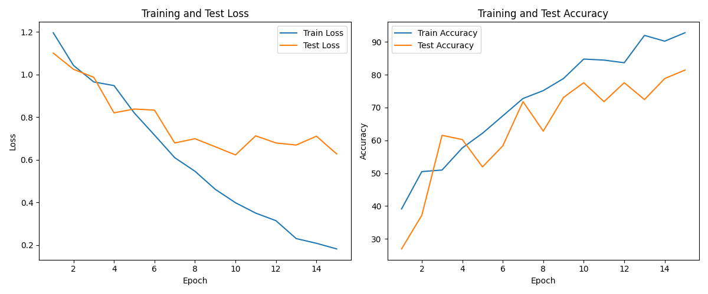

#### Confusion matrix 
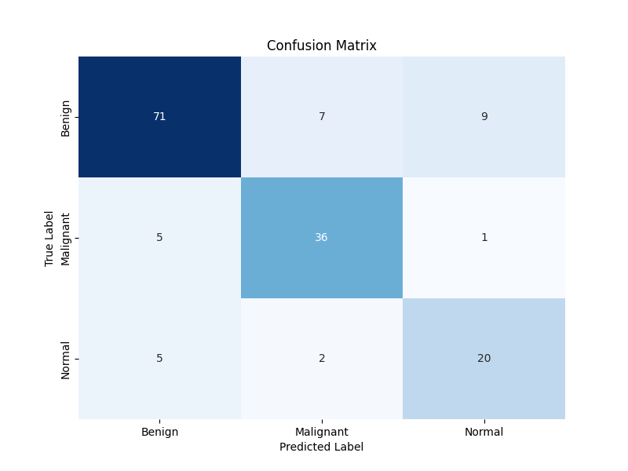

#### Complete result of model evaluation -- Overfitted
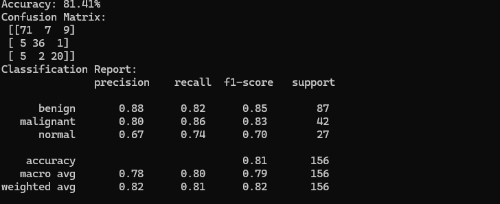

### UNet 
#### Training history - showing model being slight overfitted (around 6% gap)
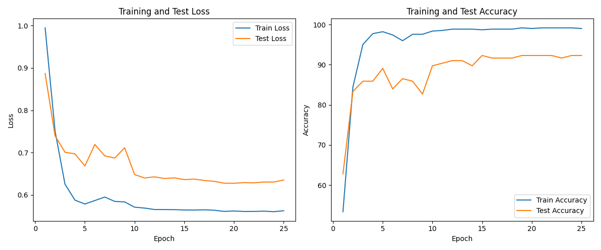

#### Confusion matrix 
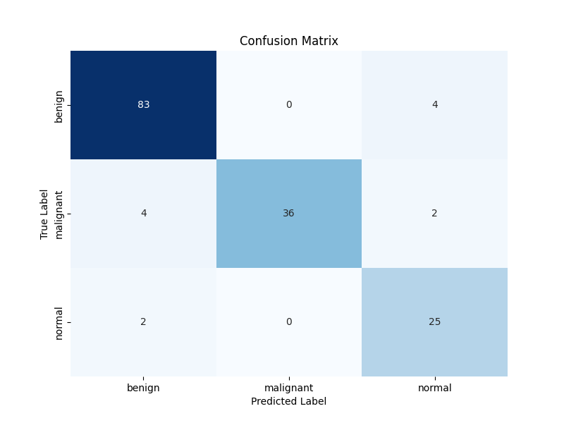

#### Complete result of model evaluation -- Significantly better than QuadCNN 
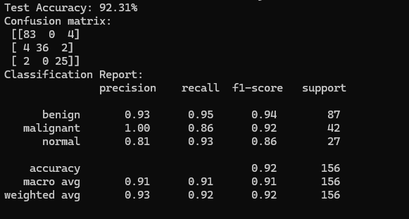

## StreamLit App
Use following command on terminal to run the app:
```bash
streamlit run app.py
```
### Home page 
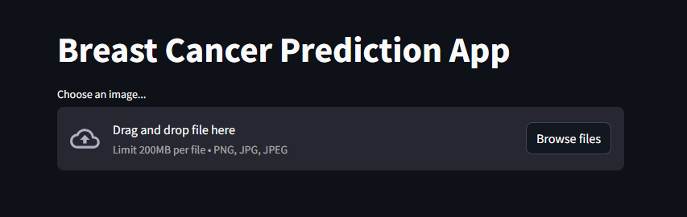

### Uploading a malignant ultrasound
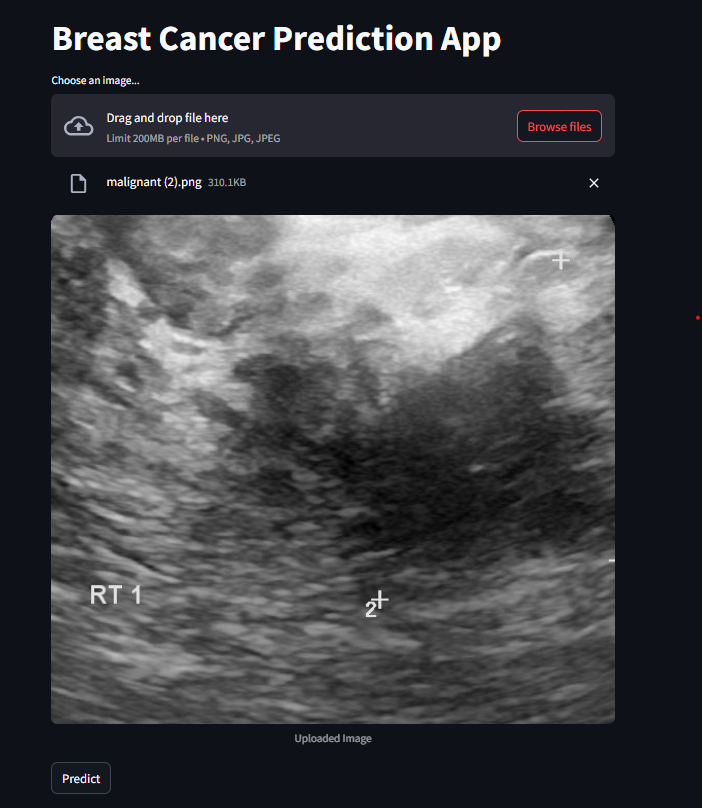

### Predicting as Malignant
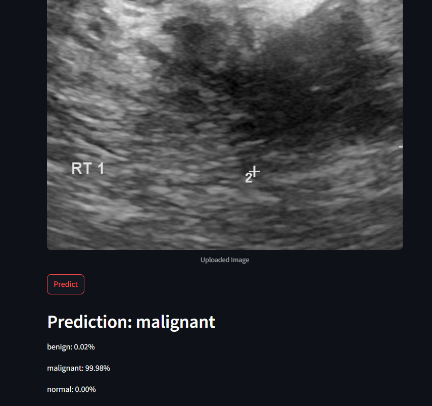

### Uploading a benign ultrasound
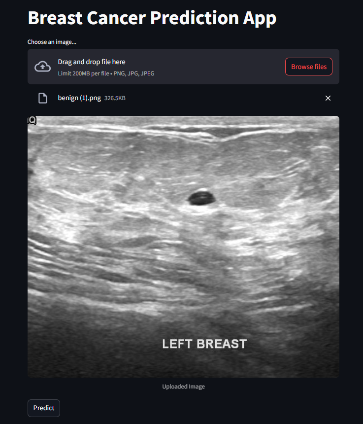

### Predicting as Benign
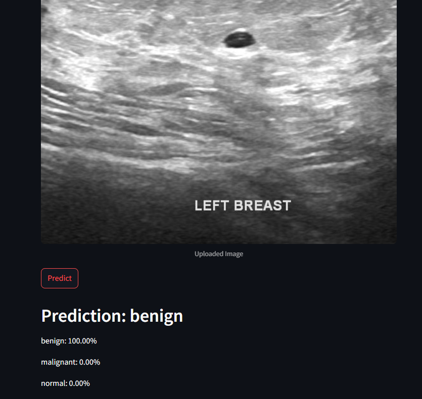

### Normal breast ultrasound load & prediction
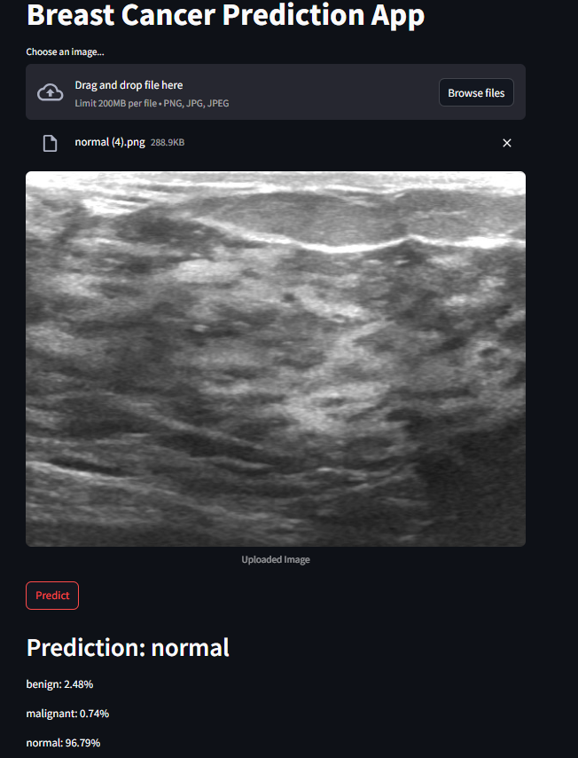

## Libraries Used 
Many Python libraries is being used such as NumPy, Matplotlib, Seaborn, PyTorch etc.
To download the dependencies used in this project, use following command on terminal
```bash
pip install -r requirements.txt
```

## Cloning and using the repository 
To clone this project on your system, use the following command on terminal:
```bash
git clone https://github.com/UmerSalimKhan/Breast-Cancer-Ultrasound-Prediction.git
```

It is recommended to create a virtual environment for this project. Once, this project repository is cloned, moved to the project root folder and execute the above command. Once, all this is set, use the StreamLit command provided in StreamLit App section.

> Virtual Environment Command:
 
```bash 
python -m venv breast_cancer_env

# Windows - Activate virtual environment
breast_cancer_env\Scripts\activate

# Windows - deactivate virtual environment
deactivate
```